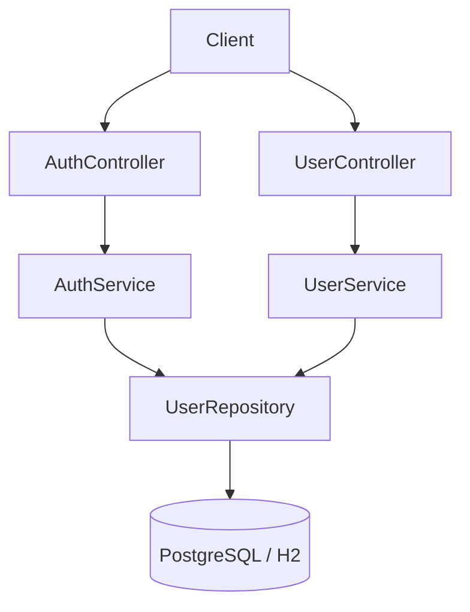
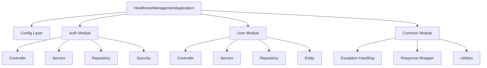

---

# 🏥 Healthcare Management System (Backend)


A **scalable backend system** for healthcare operations built using **Spring Boot**, designed with a **feature-based modular architecture** to support future transition into microservices.

---

# 🚀 Key Features (Current & Planned)

### ✅ Current

* User Registration API
* Basic Authentication module structure
* Password encryption (BCrypt)
* Modular architecture foundation

### 🔜 Upcoming

* JWT Authentication
* Role-Based Access Control (RBAC)
* Doctor & Patient management
* Appointment system
* Kafka event streaming
* Elasticsearch for search optimization
* Dockerized deployment
* CI/CD pipeline

---

# 🧠 System Architecture

## 📌 High-Level Architecture



---

## 🏗️ Code Architecture (Modular Monolith)



---

# 📦 Project Structure

```text
com.healthcaremanagement

├── config/                # Security & App configuration
├── common/               # Shared utilities, exceptions, responses
│   ├── exception/
│   ├── response/
│   └── util/
│
├── auth/                 # Authentication module
│   ├── controller/
│   ├── service/
│   ├── dto/
│   ├── security/
│
├── user/                 # User management module
│   ├── controller/
│   ├── service/
│   ├── repository/
│   ├── entity/
│   └── dto/
│
└── HealthcareManagementApplication.java
```

---

# ⚙️ Tech Stack

| Layer        | Technology      |
| ------------ | --------------- |
| Backend      | Spring Boot     |
| Security     | Spring Security |
| ORM          | Spring Data JPA |
| Database     | H2 / PostgreSQL |
| Build Tool   | Maven           |
| Java Version | 17+             |

---

# 🚀 Getting Started

## 1. Clone Repository

```bash
git clone <repo-url>
cd healthcaremanagement
```

## 2. Build Project

```bash
mvn clean install
```

## 3. Run Application

```bash
mvn spring-boot:run
```

---

# 🌐 API Documentation

## 🔐 Auth APIs

### Test Endpoint

```http
GET /api/auth/test
```

**Response**

```json
"Auth working"
```

---

### Register User

```http
POST /api/auth/register
```

**Request**

```json
{
  "email": "test@example.com",
  "password": "123456"
}
```

**Response**

```json
{
  "message": "User registered successfully"
}
```

---

# 🗄️ Database Configuration

### H2 (Development)

```yaml
spring:
  datasource:
    url: jdbc:h2:mem:testdb
    driverClassName: org.h2.Driver
    username: sa
    password:

  jpa:
    hibernate:
      ddl-auto: update
```

### H2 Console

```
http://localhost:8080/h2-console
```

---

# 🔐 Security Design

* Password hashing using **BCrypt**
* Stateless authentication (JWT planned)
* Modular security configuration
* Future RBAC support:

  * ADMIN
  * DOCTOR
  * PATIENT

---

# 📈 Roadmap

## Phase 1 (Current)

* Project structure setup
* Auth module foundation
* User registration API

## Phase 2

* JWT authentication
* Login system
* Global exception handling

## Phase 3

* Role-based access control
* User profile system
* Appointment module

## Phase 4 (Advanced)

* Kafka event system
* Elasticsearch integration
* Microservice decomposition
* Docker + CI/CD pipeline

---

# 🐳 Deployment (Upcoming)

```text
Dockerized Spring Boot App
PostgreSQL container
Kafka cluster (event-driven design)
CI/CD via GitHub Actions
```

---

# 🧠 Engineering Principles Used

* Feature-based modular architecture
* Separation of concerns (Controller → Service → Repository)
* DTO-based API design
* Scalable monolith → microservices ready
* Clean dependency boundaries

---

# ⚠️ Notes

* This project is actively evolving.
* Architecture is intentionally designed for **enterprise scalability**.
* Current focus: strong backend foundation before infrastructure complexity.

---

# 👨‍💻 Author

Built as a **senior backend engineering practice project** focused on:

* System design
* Scalable architecture
* Production-grade backend development

---
